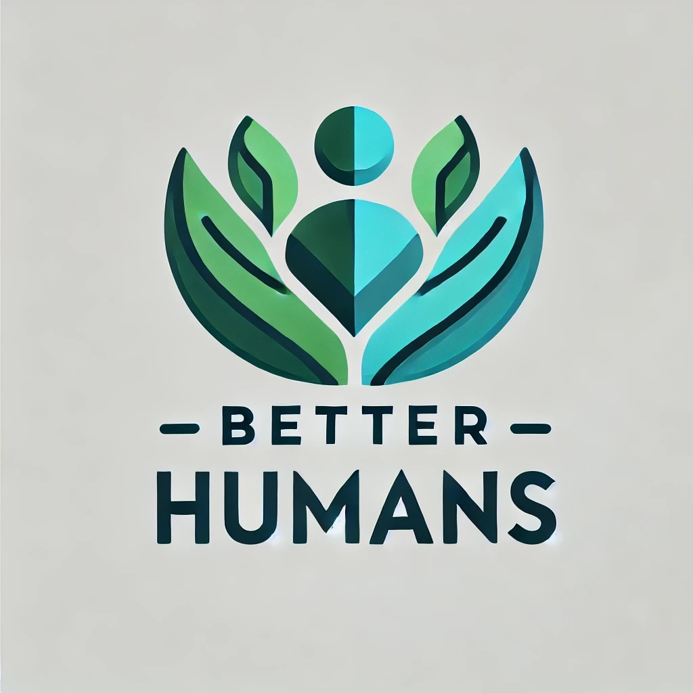
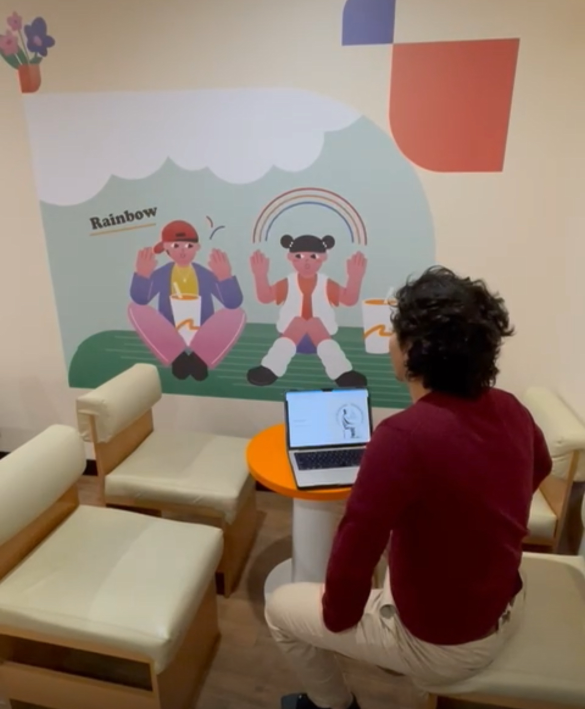
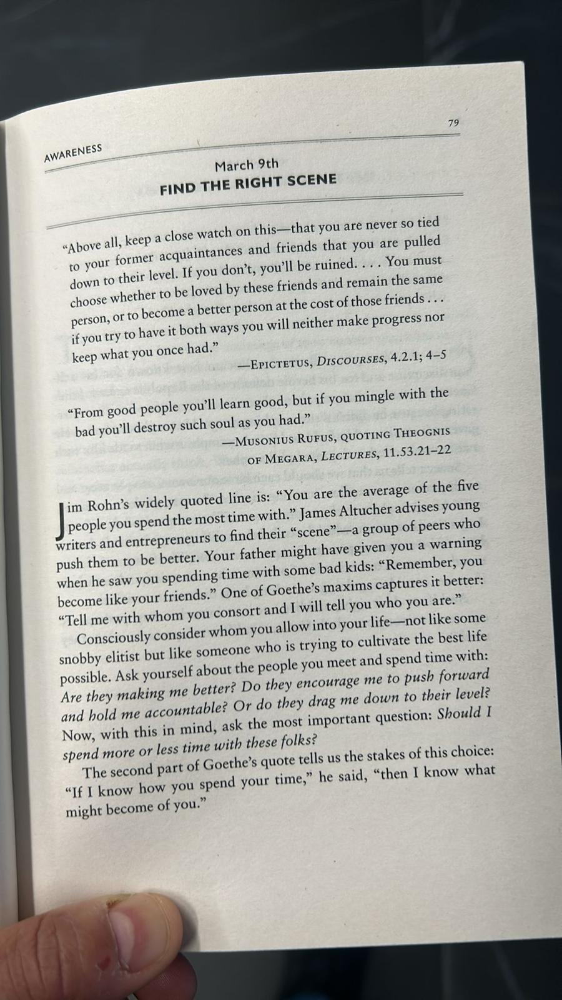
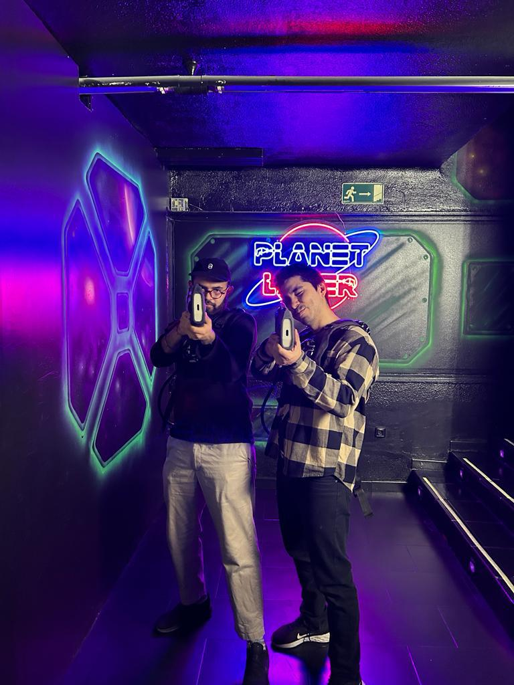
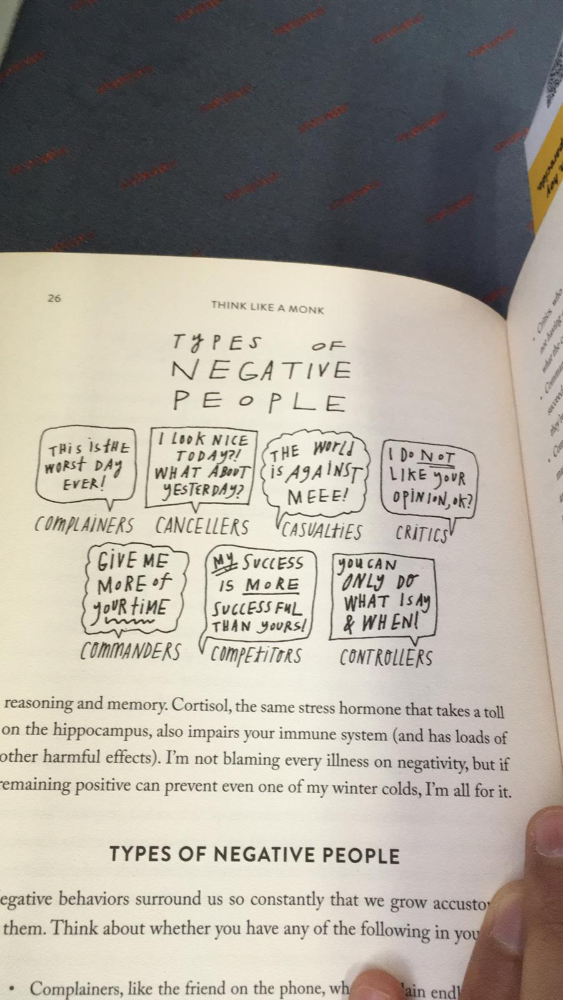

# Presentations

This repository will help to store the groups presentations in our activities

* [Stoicism](https://bhumans.github.io/presentations/stoicism.html): A guide to a better life

* [I Heart Me](https://bhumans.github.io/presentations/i-heart-me.html): The importance of self esteem and the science behind it. *David R. Hamilton [1](https://www.goodreads.com/book/show/21255074-i-heart-me)*

* [Active Listening](https://bhumans.github.io/presentations/active-listening.html): We discuss the meaning of active listening and the possible benefits to our life.

* [Why therapy](https://bhumans.github.io/presentations/why-therapy.html): Understanding the power it can have in our lives...

* [Emotional Intelligence](https://bhumans.github.io/presentations/emotional-inteligence.html): The basics of emotions for the use in our lives

## Gallery

    
    
    
    

## Help
Im trying to become a better listener. If you have some time and want someone to listen to you, you can use me as practice
and both of us benefit from it :)
<!-- Google Calendar Appointment Scheduling begin -->
<iframe src="https://calendar.google.com/calendar/appointments/schedules/AcZssZ3VM5Ok6973SXpPM08F8O8sOZhXkOLp0gV6jTizLVWCrc0FsYvwH5H8kxs7Hja5hi9vZ_8SI84p?gv=true" style="border: 0" width="100%" height="600" frameborder="0"></iframe>
<!-- end Google Calendar Appointment Scheduling -->

## Love and appreciation
<ul>
    <li>
        

            <a href="https://github.com/IndianTinker"> Rohit Gupta 
            </a>
        

    </li>
</ul>

    Made with ❤️ 
    

 