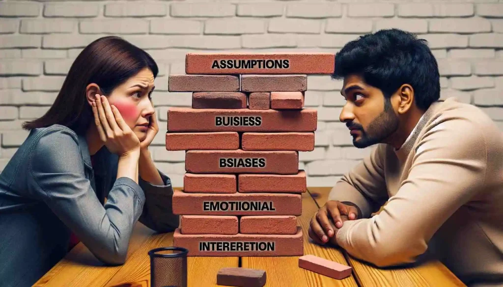

# Active Listening 
A tool for understanding others

---

## What is active listening? 
Active listening is being fully engaged while another person is talking to you. It is listening with the intent to understand the other person fully, rather than listening to respond. Carl Rogers and Richard Farson coined the term "active listening" in 1957

 
 
 
 
 

---

## Components Active Listening

* **Paraphrasing:** We use to to verify that we understood the message. We want to use our own words to reflect what the person said. 

* **Reflective emotion:** When we reflect the persons emotion, there is a sense of feeling understood. This should be done in a genuine way. 

* **Open-ended questions:** We use it to deepen the conversation even more. We are looking to more than a yes/no answer. We are looking to unfold an onion. A question is use to take out one layer. 

---

* **Assume positive intentions:** If the person that is speaking feels judge in some way, there is a chance that they will become defensive opposite to being vulnerable and vulnerability is the door for intimacy

* **What's behind the curtain:** A lot of the times what people says has a deeper meaning. Its about uncovering what is behind the words, body language and emotions. By paying attention to these nuances, you can uncover the unspoken needs, fears, or desires behind someone’s words

---

## Barriers

* Our own emotions
* Lack of focus
* Lack of motivation
* Our ego
* Not being genuine

---

## From Carl Rogers
>  Until we can demonstrate a spirit which genuinely respects the potential worth of the individual, which considers his sights and trusts his capacity for sell-direction, we cannot begin to be effective listeners

> Besides providing more information than any other activity, listening builds deep, positive relationships and tends to alter constructively the attitudes of the listener. Listening is a growth experience.

> Active listening is not an easy skill to acquire. It demands practice. Perhaps more important, it may
require changes in our own basic attitudes. These changes come slowly and sometimes with considerable
difficulty.

---

## Lets Practice

You are meeting with a friend that is angry and she is telling the following story:

**She:** I hate comming to this coffee shop. The other day and the waiter brought me the cold coffee. I was soo angry that I said that they were useless. Crazy how mediocre people can be at their job

BAD: **You**: Thats crazy, why would you call them useless? Is quite disrespectufil to say that to anyone, specially over cold coffee. (Ego)

Better: **You**: Sounds like you get very angry when people don't do what they are supposed to do. Is their job after all. (Paraphrase)

**She**: Exactly, my mom used to say that "If you do something, you better do it right". 

---

Bad: **You**: I remember one time, I went to the supermarket and a person called me a bitch in front of everyone because I bumb into her. Some people get angry for nothing.  (Making the convo now about you)

**You**: Did she also got angry at you too when you didnt do things they way she expected? Did she expect a lot of things from you? (Open ended questions, go more deep, seeing beheind the curtains)

**She**: Yeah, she was sooo strict. I have to be good at school, be good at sports, have the perfect boyfriend, bee skinny. A lot of times I felt like it was never enough for her.

Bad: **You**: You get a message and you start reading it while at the same time pretending to listening (Lack of focus)

---

**You**: Woao, sounds like it was very difficult to be around her. Feeling like your not good enough is an awful feeling. (Paraphrasing, reflect emotiosn) 

**She**: Yeah, now Im happy that we dont leave together anymore. My life was miserable with her. 

BAD **You**: So you are happy that you dont live with her anymore. Your life was miserable with her. You should know that your feelings are valid. (Not being genuine)

**You**: Do you think you can also put that same pressure on you or others? (More deep)

**She**: Yeah, that is one of my problems at work. I work so much that I dont have time for anything else. Also, I feel like everyone at work hates me. Im sure they all think Im a horrible bitch. I just want to be good at my job you know.  

---
BAD: **You**: Ahh but see that you are doing the same to others what your mom did to you. Dont you see it. You are repeating her pattern. Of course people will call you a bitch. (Ego)

**You**: I think I can sympathize with that. I also want to be good at what I do. (Reflecting emotions)

---

## Homework
 
Next time you go and talk to anyone, do this challenge. Start a timer and for the next 20 minutes, the only thing that can come out of your mouth is another question. Try noticing how difficult it is. 

---

## Conclusion

---

## Resources

### Videos
    * Empathic Listening: https://www.youtube.com/watch?v=2dLsgpHw5x0
    

### Read
    * Business Journal: https://wholebeinginstitute.com/wp-content/uploads/Rogers_Farson_Active-Listening.pdf