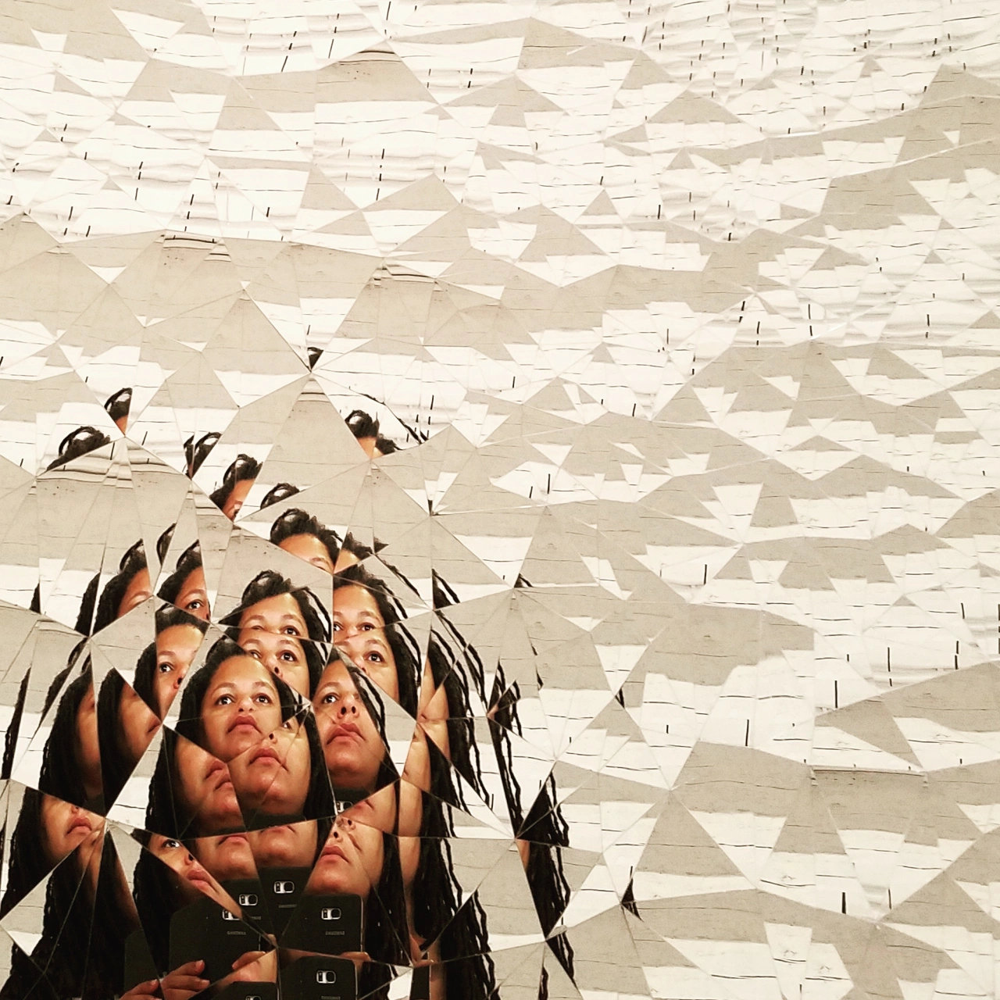
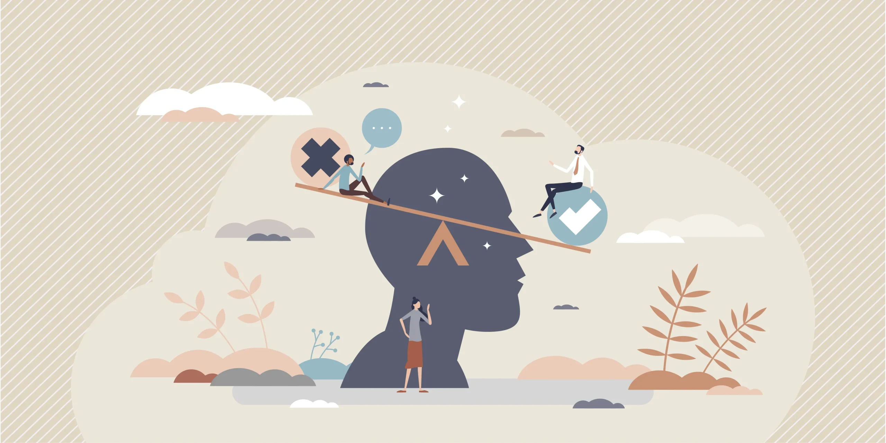

# Am I Blind? 
How our biases prevent us from seeing reality


---

## Introduction
- Definition of biases
- Impact of biases on perception

---

## Understanding Bias
- What does the science says 
- List of biases
```
Confirmation Bias: The tendency to search for, interpret, and remember information that confirms pre-existing beliefs.

Anchoring Bias: Relying too heavily on the first piece of information encountered (the anchor) when making decisions.

Dunning-Kruger Effect: A cognitive bias wherein individuals with low ability at a task overestimate their ability.

In-group Bias: The tendency to favor one’s own group over others, impacting judgments about individuals from different groups.

Sunk Cost Fallacy: Continuing an endeavor once an investment in money, effort, or time has been made, even when it may not be the best decision moving forward.

Self-serving Bias: The habit of attributing positive events to one’s own character but attributing negative events to external factors.

Framing Effect: Drawing different conclusions based on how information is presented, such as wording or context.

```

---
<!-- backgroundColor: #e0d7c4 -->

## Impact on everyday life
Think on how biases mentioned before have affected your life



---
<!-- backgroundColor: white  -->

## Overcoming Bias
- Biases thrive under time pressure. Pause before making judgments about people or situations.
- Learn to listen. Seeing others perspective can give you a comparison to notice your own distortion
- Regularly question your assumptions and reactions. Ask yourself: *"Why do I think this way? Is this based on evidence or stereotypes?"*
- Thinking you dont have a bias is a bias in itself. **Blind spot bias**. Trying to not have a bias is not reasonable, learning how to manage them is. 
- Take a **Implicit Association Test**. Measures attitudes and beliefs that people may be unwilling or unable to report.
- Seek feedback – Ask others if they notice biases in your decisions.

---

## Conclusion
Cognitive biases are mental shortcuts that often lead to flawed perceptions, irrational decisions, and unintended consequences. Whether in law, medicine, business, or everyday life, these biases distort reality, reinforcing stereotypes, perpetuating inequalities, and causing costly mistakes.
