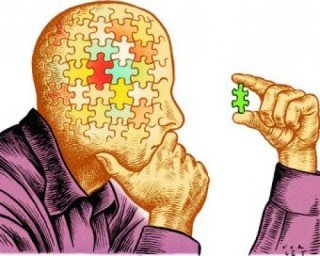

# Emotional Intelligence
The basics of emotions for the use in our lives

---

# What is Emotional Intelligence?

Emotional Intelligence is the ability to:
- Recognize and understand emotions in yourself and others
- Manage your emotions effectively
- Use emotional information to guide thinking and behavior
- Navigate social situations successfully

---

# The Five Components

---

# 1. Self-Awareness

Understanding your own emotions, strengths, weaknesses, values, and motivations

**Key aspects:**
- Recognizing your emotions as they happen
- Understanding how your feelings affect your performance
- Having a realistic assessment of your abilities
- Maintaining self-confidence

---

Practice these techniques:
- Keep an emotion journal
- Take regular self-reflection breaks
- Ask for feedback from others
- Notice your emotional triggers
- Pay attention to your physical responses

---

# 2. Self-Regulation

Managing your emotions and impulses effectively

**Benefits:**
- Better decision-making
- Increased adaptability
- Improved stress management
- Enhanced reputation
- Stronger relationships

---

Self-Regulation Strategies

- Practice mindfulness
- Use the pause-think-act approach
- Identify your values
- Take responsibility for your actions
- Learn from setbacks

---

# 3. Motivation

Internal drive to pursue goals beyond external rewards

**Characteristics:**
- Strong drive to achieve
- Commitment to goals
- Initiative
- Optimism
- Resilience

---

Building Motivation

- Set meaningful personal goals
- Break large goals into smaller steps
- Celebrate small wins
- Find your 'why'
- Maintain a growth mindset

---

# 4. Empathy

### Understanding and sharing the feelings of others

**Types of Empathy:**
- Cognitive Empathy (understanding)
- Emotional Empathy (feeling)
- Compassionate Empathy (acting)

---

### Developing Empathy

- Practice active listening
- Put yourself in others' shoes
- Observe body language
- Be curious about people
- Challenge your prejudices

---

# 5. Social Skills

Managing relationships and building networks

**Key abilities:**
- Communication
- Leadership
- Conflict management
- Team collaboration
- Building bonds

---

# Improving Social Skills

- Practice clear communication
- Learn to give and receive feedback
- Develop conflict resolution skills
- Show appreciation for others
- Build and maintain relationships

---

# Benefits of High EQ

You will be the conquerer of your own life

---
