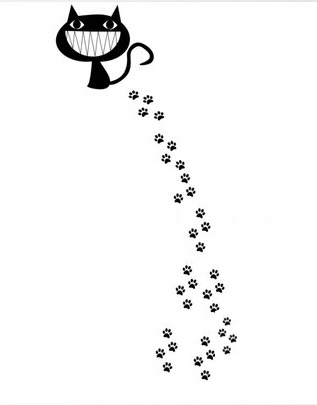

# **It Wasn’t Me**

### Sometimes the villain is you


---

## **Introduction**

Relationships are complex and require effort from both sides. Often, we focus on the things that have been done to us and that is the story we tell others and to ourselves

### Could we have been the villain in a story?

---

## **The Illusion of Innocence**

We often see ourselves as the hero or victim in conflicts, no one sees themselves as the bad guy in the story. 


---

### Self-Serving Bias
Tendency to attribute positive outcomes to our own actions and negative outcomes to external factors.

```
* Our relationship is great because I put in all the effort.
* We’re having problems because they don’t communicate well.
* I’m not perfect, but I’m definitely not the problem here.
```
---

## **Characteristics of the Villain**

1. **Lack of Accountability**

2. **Manipulation**

3. **Selfishness**

4. **Avoidance**

> Villains are frecuently born from trauma


---

## **Why It Happens**

- **Ego Protection:** Admitting fault can feel like a blow to our self-esteem.
- **Lack of Self-Awareness:** We may not realize how our behavior affects others.
- **Fear of Vulnerability:** Taking responsibility can make us feel exposed.
- **Insecurities:** Hiding my weaknessnes because of negative feelings of shame or maybe fear of loss. 

---

## **The Impact on Relationships**

- Erodes trust and emotional safety.
- Creates resentment and distance
- Prevents growth and resolution
- Blocks intimacy
- Creates conflict

---

## **How to Change the Narrative**

1. **Listen and validate**
   Listen to your partner’s perspective without defensiveness, without judgement. Understand their perspective, validate their feelings. 

2. **Practice Self-Reflection**
   To fix the problem we need to see the problem. Asume that you did something and look for it

3. **Take Responsibility**
   Once you see the problem, speak out. **I did this!**. Learn to manage **shame** and **guilt**

4. **Commit**
    Focus on the things that you are responsable for and commit to improvement

---

## **Conclusion**

- Villains and healthy relationshipts cant coexist
- We will never have a good relationshipt if we are blind to our own faults
- Being blind, limits our potential

### "It wasn’t me" can become "It was me, and I’m willing to change."

