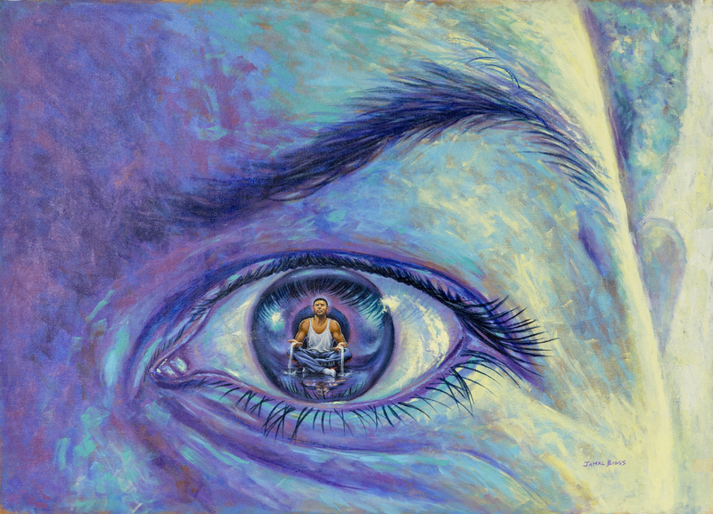

# **Know Thyself**
The Art and Science of Introspection


---

## Introduction
What is the meaning of instrospecction? 
How does it look like? 

```
You are talking to yourself
You are trying to understand something by only using your thoughts
You are trying to sense your emotions
You might be journaling or writing down your thoughts and feelings.
You could be meditating.
You might be taking a walk or spending time in nature, allowing your thoughts to flow.
You could be asking yourself "why" questions about your reactions and behaviors.
You might be silently observing your own thoughs

```

---

## Benefits of Introspection

* **Self-Awareness:** It increases understanding of your own strengths, weaknesses, values and triggers.
* **Mental Clarity:** It helps us to clear out any confusion that we have
* **Increase sense of control:** we have a better control of our life because we understand what is exactly happening
* **Enhanced Problem-Solving:** “Fifty percent of the cure is the diagnosis” In order to solve any issue we need a good understanding of the problem. 
* **Builds confidence:** A lot of the time we don’t trust ourselves or our intuition because we don't understand where it comes from. Doing introspection gives us understanding, which allows us to gain trust in us
* **We understand others:** As we understand ourselves better we can extrapolate the same understanding into others. At the end of the day we are all humans. 
* **Resilience to manipulation:** Manipulation involves the influence of another person in us. If we know exactly what we want, the influence of others becomes minimal. 

---

## We become superhuman
You know who you are, 
you know what you want, 
you know what you need, 
<br />
>“Life just becomes easier”


---

## Techniques for Introspection

* Therapy
* Journaling
* Meditation
* Look for the answer in you
* Self-Questioning
* Seeking Feedback

### Challenges in Introspection

* Cognitive Bias
* Avoidance
* Overthinking 
* Emotional Intensity

---

## How we (could) use it in our life?
