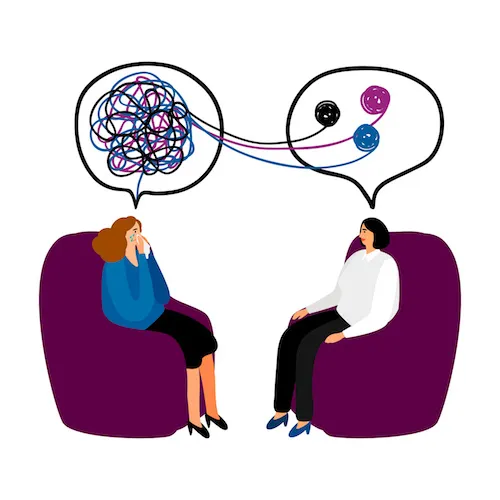

<!-- backgroundColor: #7BA7BC -->
<!-- color: #F8F9FA -->

# Why Therapy?
Understanding the power it can have in our lives...

---

<!-- backgroundColor: #8CAA92 -->

# What is Therapy?

A collaborative journey with a mental health professional that offers:

- A safe, confidential space for personal growth
- Professional guidance for emotional healing
- Evidence-based techniques for positive change
- Support for mental well-being

---

<!-- backgroundColor: #8CAA92 -->

# How Therapy Helps

- Work through emotional challenges
- Process past experiences and trauma
- Develop effective coping strategies
- Improve relationships and communication
- Address anxiety and depression
- Set and achieve personal goals
- Build self-awareness

---

<!-- backgroundColor: #9F8BA3 -->

# The Evolution of Therapy

## Ancient Times
- Mental health linked to spirituality
- Greeks pioneer medical perspective
- Hippocrates: natural causes theory

---

<!-- backgroundColor: #9F8BA3 -->

# Birth of Modern Therapy

## 1800s - Early 1900s
- Shift from asylums to humane treatment
- Freud introduces psychoanalysis
- Development of talk therapy
- Jung's analytical psychology emerges

---

<!-- backgroundColor: #7BA7BC -->

# Therapy Today

## Modern Approaches
- Evidence-based treatments (CBT, DBT)
- Reduced social stigma
- Greater accessibility
- Online therapy options
- Personalized care plans

---

### Most Common
1. Cognitive Behavioral Therapy (CBT)
2. Psychodynamic Therapy
3. Mindfulness-Based Therapies

### Moderately Common:
4. Dialectical Behavior Therapy (DBT)
5. Eye Movement Desensitization and Reprocessing (EMDR)
6. Solution-Focused Brief Therapy

---

### Less Common:
7. Gestalt Therapy
8. Art Therapy
9. Psychodrama

### Emerging/Specialized:
10. Internal Family Systems (IFS)
11. Somatic Experiencing
12. Acceptance and Commitment Therapy (ACT)

---

<!-- backgroundColor: #8CAA92 -->

# Benefits of Therapy

## Personal Growth
- Better emotional regulation
- Improved relationships
- Enhanced self-awareness
- Stronger coping skills
- Greater life satisfaction

---

<!-- backgroundColor: #7BA7BC -->

# Taking the First Step

## Ready to Start?
- Research different therapy types
- Find licensed professionals
- Check insurance coverage
- Schedule initial consultation
- Begin your journey to well-being

