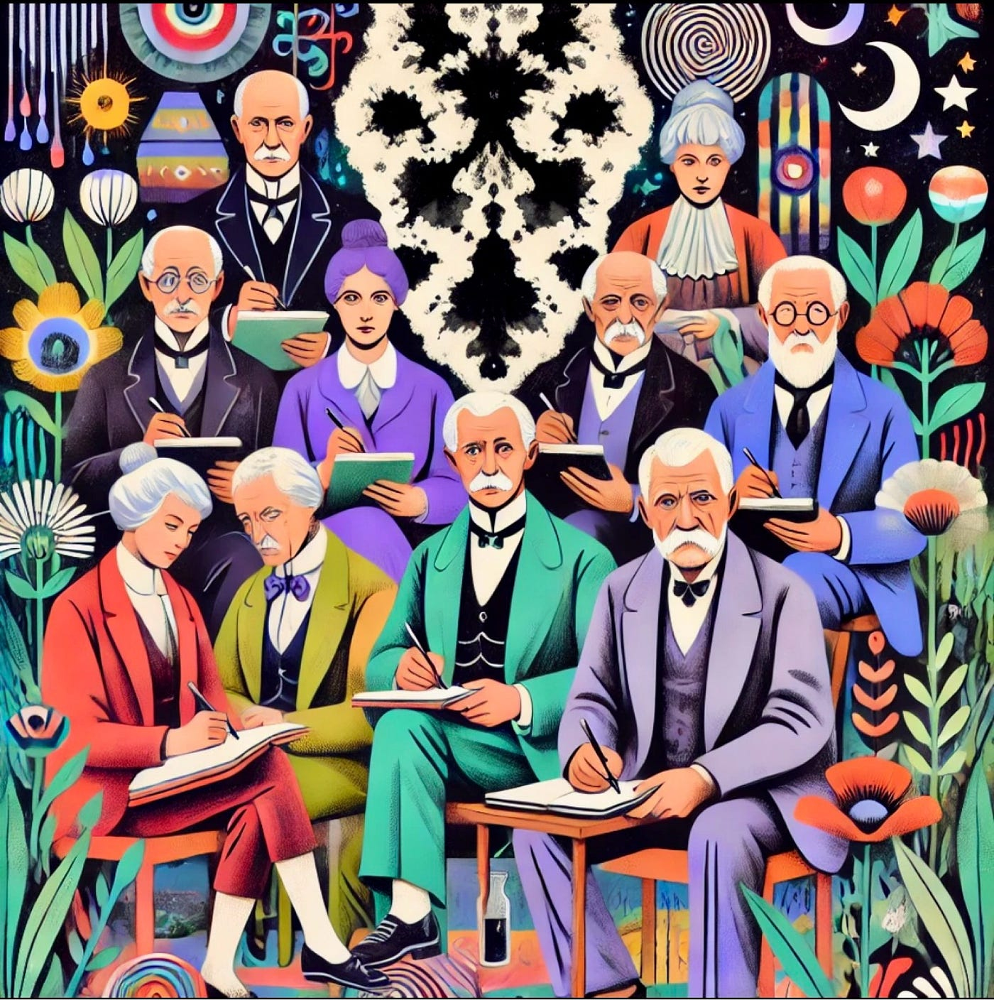
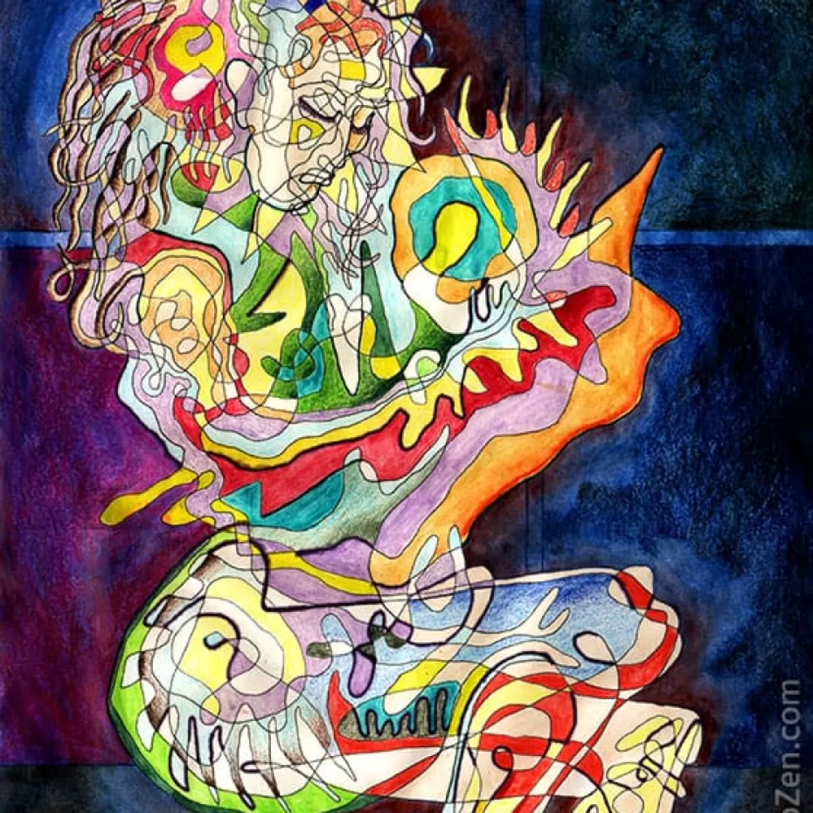

<!-- backgroundColor: #7BA7BC -->
<!-- color: #F8F9FA -->

# Why Therapy?
Understanding the power it can have in our lives...

---

<!-- backgroundColor: #8CAA92 -->

# What is Therapy?

A collaborative journey with a mental health professional that offers:

- A safe, confidential space for personal growth
- Professional guidance for emotional healing
- Evidence-based techniques for positive change
- Support for mental well-being

---

<!-- backgroundColor: #9F8BA3 -->

# The Evolution of Therapy

* Ancient Greece with Hippocrates, Ayurvedic in India, The Ancient Egyptians, etc. 
* Shift from asylums to humane treatment 1800-1900
* Freud introduces psychoanalysis and later came Jung with analytical psychology
* Aaron Beck develops Cognitive Therapy (CBT)

---

<!-- backgroundColor: #7BA7BC -->

# Therapy Today

### Most Common
1. Cognitive Behavioral Therapy (CBT)
2. Psychodynamic Therapy
3. Mindfulness-Based Therapies

### Moderately Common:
4. Dialectical Behavior Therapy (DBT)
5. Eye Movement Desensitization and Reprocessing (EMDR)
6. Solution-Focused Brief Therapy

---

### Less Common:
7. Gestalt Therapy
8. Art Therapy
9. Psychodrama

### Emerging/Specialized:
10. Internal Family Systems (IFS)
11. Somatic Experiencing
12. Acceptance and Commitment Therapy (ACT)

---

<!-- backgroundColor: #8CAA92 -->

# How it has helped me?

* Crazy amount of self awareness for myself and towards others
* Feeling like Im not crazy. Im not broken
* Capability to focus on others on a whole new level. 
* Understanding on I work as a human
* Emotional self regulation and impulse control
* Giving myself some kind of self therapy.
